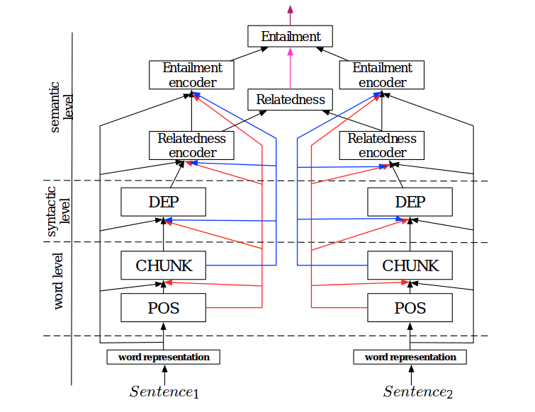

# A Joint Many-Task Model: Growing a Neural Network for Multiple NLP Tasks

Multiple Different Natural Language Processing Tasks in a Single Deep Model

## Model Architecture:

## Tasks:

* POS Tagging
* Chunking
* Semantic Relatedness
* Textual Entailment

## Usage:

`python run.py` Check run.py for more details.

## Note:

The original paper contains one more task which is dependency parsing. Currently, that is not incorporated in the model due to
non-availability of good public data.

## Citations:

A Joint Many-Task Model: Growing a Neural Network for Multiple NLP Tasks
Kazuma Hashimoto, Caiming Xiong, Yoshimasa Tsuruoka, Richard Socher

https://arxiv.org/abs/1611.01587

